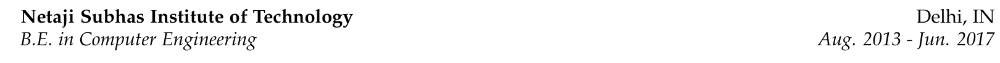

# Resume

[](https://github.com/rohit-gohri/resume-template/actions?query=branch%3Amaster)


Automatically built resume with LaTeX. The structure for sections is defined in `resume.cls` file. While the content is in `resume.tex`.

> Based on the [CV For Freshers](https://www.overleaf.com/latex/templates/cv-for-freshers/jkpwvnrdrxpm) template on Overleaf.

### [Preview latest version](https://docs.google.com/viewer?url=https://github.com/rohit-gohri/resume-template/releases/latest/download/Preview.pdf)

### [Download latest version](https://github.com/rohit-gohri/resume-template/releases/latest/download/Preview.pdf)

### Blog Post: [CI/CD for your Resume](https://rohit.page/blog/projects/ci-cd-for-your-resume-wth-this-github-template/?utm_source=github&utm_medium=repo&utm_campaign=hf)

## Resources

- [Begin Latex](https://github.com/luong-komorebi/Begin-Latex-in-minutes)
- [Latex Advice](https://github.com/dspinellis/latex-advice)
- [Useful Packages](https://tex.stackexchange.com/questions/553/what-packages-do-people-load-by-default-in-latex)
- [Overleaf](https://www.overleaf.com/): Online Editor
- [Original Template](https://www.overleaf.com/latex/templates/cv-for-freshers/jkpwvnrdrxpm)
- Automatic [builds](https://github.com/rohit-gohri/resume-template/actions) with Github Actions on every push and automatic [releases](https://github.com/rohit-gohri/resume-template/releases) on publishing tags

## Using as a template

Use the green **"Use this template"** button to create a new repository with this repository's files as a template. There are two files only:

- `resume.cls`: Defines the structure and all the custom commands. No need to modify this.
- `resume.tex`: This is the file where all your content for the resume goes. Your name, email, links, etc. are defined through commands. Feel free to move things around and change them.

If there is any problem with the format, feel free to open an issue in this repo. It will probably involve a fix in the `resume.cls` file. Once that gets pushed, you can just copy the new `resume.cls` file over your existing one.

## Building

### Online

#### [Overleaf](https://www.overleaf.com/)

- [Download a zip](https://github.com/rohit-gohri/resume-template/archive/master.zip) of the project.
- Go to Overleaf and login/signup
- "New Project" -> "Upload Project" : Upload the zip

### Locally

Install a LaTeX distribution that includes `pdflatex`.

#### Windows

Use [Scoop](https://scoop.sh/)

`scoop install latex`

##### Run

```
mkdir dist
pdflatex.exe -output-directory dist resume.tex
```

#### Docker

Use the [`tianon/latex`](https://hub.docker.com/r/tianon/latex/) image.

##### Run

```sh
mkdir dist
docker run --rm -v `pwd`:`pwd` -w `pwd` tianon/latex pdflatex -output-directory dist -interaction errorstopmode -halt-on-error resume.tex
```

## Included Commands/Environments

### \fmtdate - Command

Create new date and displays it according to `{shortmonthname}. {year}` format

```tex
% Default day is 01
\fmtdate{3}{2017}
% Feb. 2017

% Use full date so that format can be changed in future without having to change all dates
\fmtdate[1]{3}{2017}
% Mar. 2017

% Only print year by providing empty month
\fmtdate{}{2017}
% 2017
```

### \draft (renamed from \showif) - Command

Instead of commenting out blocks skip content conditionally so that atleast it is checked by latex to be valid.

```tex
% Default output is hidden
\draft{Test Content}
%

% Show in output, preferably remove command once you've decided to keep the content
\draft[true]{Test Content}
% Test Content
```

Also works for blocks of content:

```tex
\draft[false]{
\begin{rSection}{Activities} \itemsep -2pt
    \item XXXXXXXXXXXXXXX
    \item YYYYYYYYYYYYYYY
    \item ZZZZZZZZZZZZZZZ
\end{rSection}
}
%
```

### \rSection - Environment

Define a section with a title and many subsections/items.

### \rSubsection - Environment

Define a subsection with a subsection heading (first 4 args, defined below) and a list of items under it.

### \rSubsectionHeading - Command

Command to print subsection heading. Output depends on number of non empty arguments

```tex
% 2 Params
\rSubsectionHeading
    {Netaji Subhas Institute of Technology}
    { \fmtdate{8}{2013} - \fmtdate{6}{2017} }
    {}{}
```


```tex
% 3 Params
\rSubsectionHeading
    {Netaji Subhas Institute of Technology}
    { \fmtdate{8}{2013} - \fmtdate{6}{2017} }
    {B.E. in Computer Engineering}
    {}
```


```tex
% 4 Params
\rSubsectionHeading
    {Netaji Subhas Institute of Technology}
    { \fmtdate{8}{2013} - \fmtdate{6}{2017} }
    {\normalfont B.E. in Computer Engineering}
    {Delhi, IN}
```



## Packages Used

### [FontAwesome](https://github.com/xdanaux/fontawesome-latex)

Use icons from fontawesome. List of available icons in [docs](http://ctan.imsc.res.in/fonts/fontawesome/doc/fontawesome.pdf).

### [DateTime](https://ctan.org/pkg/datetime)

Used to setup custom date format and custom date command.

### [hyperref](https://github.com/ho-tex/hyperref)

For `\href` links and PDF metadata.

### [mathpazo](https://ctan.org/pkg/mathpazo)

For `Palatino` font for the whole document.

### [geometry](https://ctan.org/pkg/geometry)

For setting Document margins.

### [ifthen](https://ctan.org/pkg/ifthen)

For conditional logic in `draft` command.
